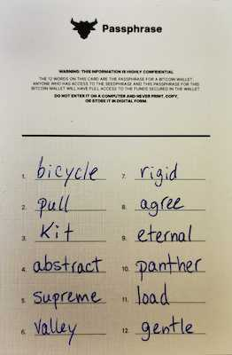

# Steps to create a passphrase

1. Go to the “Settings” menu by clicking on the three dots in the upper right corner.
2. Enable “Advanced Mode”.
3. Go back to the wallet dashboard and select “Add now” under Add Wallet.
4. Select “Import wallet”.
5. Enter your 12 word seed phrase.
   * Separate each word with a space.
6. Enable the “Passphrase” option.
7. Click on “Import”.
8. Enter your passphrase.
9. Click “OK”

