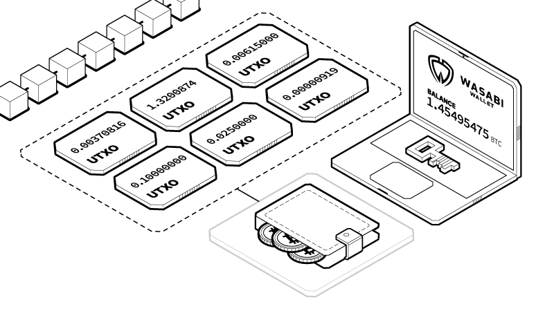

# Sending Bitcoin - Overview

To send Bitcoin using Blue, all you need is the Bitcoin address of the recipient

Blue offers Coin Control. When you are sending transactions, you can select the individual coins available in your wallet, also known as Unspent Transaction Outputs (UTXO), that you wish to send. You can select several at a time if the balance you wish to send exceeds the balance of any one coin.

Think of bitcoins as actual physical coins of different amounts in your pocket. When you spend them, you will combine the change, and you will get some new change back.

