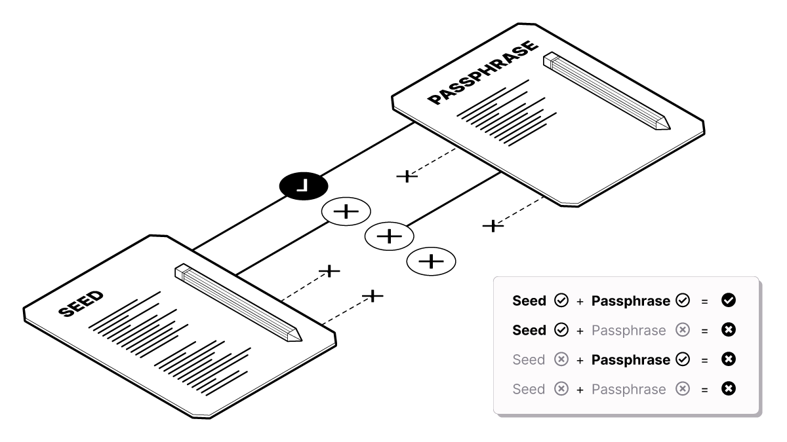

# WARNING! Important basics to know before setting up a backup

## ⛔️ <mark style="color:red;">T</mark><mark style="color:red;">**HIS IS THE MOST IMPORTANT PART. TAKE A MINUTE TO READ ALL THE INSTRUCTIONS FIRST. DO NOT SKIP. ⛔️**</mark>

The next step involves creating **a paper backup** of your Bitcoin wallet, which you will need to recover access to your Bitcoin if your phone is damaged, lost or stolen.&#x20;

The backup consists of a series of words generated randomly by the Bitcoin wallet.

**These words allow you to recover access to your Bitcoin wallet** in case anything happens to your phone**.**&#x20;

Before creating your paper backup, please read the 5 rules below carefully.


### <mark style="color:red;">**There are 5 rules to making a Bitcoin backup;**</mark>

1. If you do not have a backup and you lose access to the Blue Wallet on your phone, **you will lose access to the Bitcoin permanently.**
2. Each wallet you create in Blue Wallet has its own backup that you must write down - there is no general backup.
3. If someone finds the backup of your wallet, they can steal your money.
4. **Never store your passphrase in the same place as your backup.** Don’t leave them out in the open either, someone will take your bitcoin.

## <mark style="color:red;">5. Don't take a picture, print or share your words</mark>


